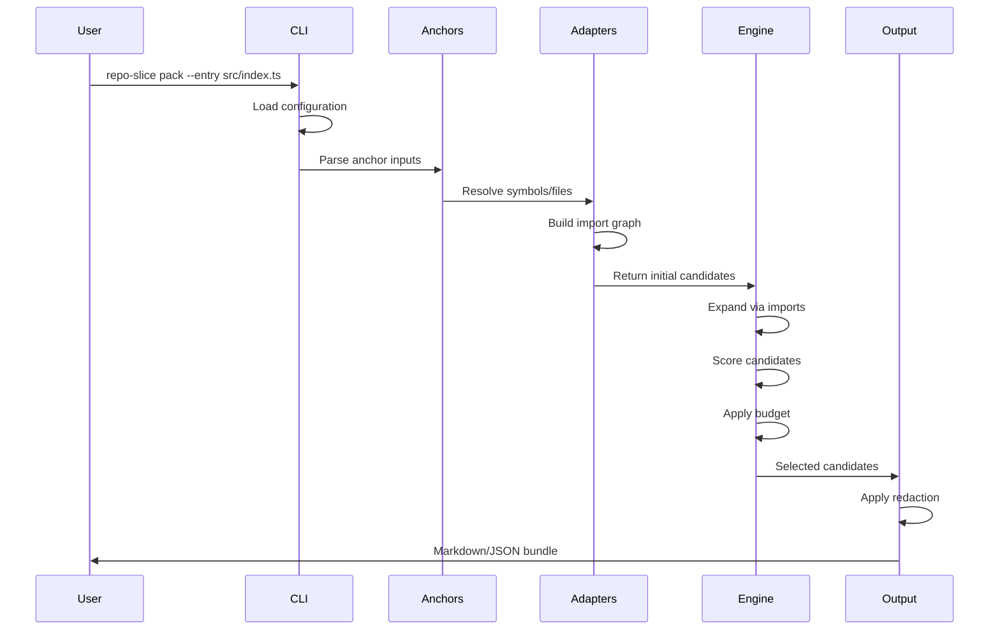

# Data Flow

## Purpose

This document describes how data moves through repo-slice from input to output.

## Pipeline Overview

## Stage Details

### 1. Input Parsing

The CLI parses the command and loads configuration:

- Parse command-line flags
- Load `.repo-slicerc.json` from repo and workspace roots
- Merge configuration (CLI flags override config files)

### 2. Anchor Resolution

Anchors are converted into initial candidates:

| Anchor Type | Resolution |
|-------------|------------|
| `--entry` | Direct file reference |
| `--symbol` | Symbol lookup via adapters |
| `--from-diff` | Git diff parsing to file/line ranges |
| `--from-log` | Log parsing to file/line references |

### 3. Workspace Scoping

The workspace system determines search boundaries:

- Detect all workspaces in the repository
- Select relevant workspace(s) based on `--workspace` flag
- Initialize appropriate adapters (TypeScript, Python, or both)

### 4. Import Graph Building

Adapters analyze source files:

- Parse source files using language-specific parsers
- Build directed import graph
- Cache results for subsequent runs

### 5. Context Expansion

The engine expands initial anchors:

- Follow imports up to `--depth` levels
- Track import distance for scoring
- Collect related files (tests, configs)

### 6. Scoring

Candidates are scored by relevance:

- Anchor type (symbol definition, diff hunk, etc.)
- Import distance from anchors
- Special boosts (barrel files, config files)

### 7. Budget Selection

Items are selected within limits:

- Sort by score (descending)
- Include items until budget exhausted
- Track omitted items for `--reason` output

### 8. Output Rendering

Final bundle is generated:

- Apply redaction patterns if enabled
- Render as Markdown or JSON
- Write to stdout or `--out` file

## Related

- [Architecture Overview](./overview.md)
- [Engine Overview](../05-engine/overview.md)
