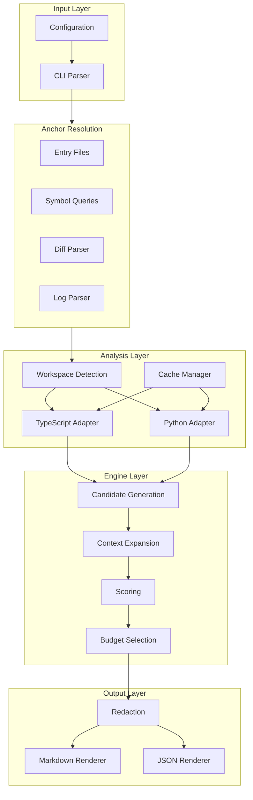

# Architecture Overview

## Purpose

This document provides a high-level view of repo-slice's architecture and how its components work together.

## System Architecture

## Component Responsibilities

| Component | Responsibility |
|-----------|----------------|
| **CLI** | Parse commands and flags, orchestrate execution |
| **Configuration** | Load and merge config from files and flags |
| **Anchors** | Convert inputs (files, symbols, diffs, logs) into starting points |
| **Workspaces** | Detect and scope to relevant project boundaries |
| **Adapters** | Language-specific indexing and symbol resolution |
| **Cache** | Persist indexing results for performance |
| **Engine** | Generate, expand, score, and select candidates |
| **Output** | Render final bundle in Markdown or JSON |
| **Redaction** | Remove sensitive values before output |

## Key Design Principles

1. **Determinism** - Same inputs always produce identical outputs
2. **Modularity** - Each component has a single responsibility
3. **Extensibility** - New languages via adapters, new anchors via parsers
4. **Performance** - Caching and workspace scoping for large repos

## Related

- [Data Flow](./data-flow.md)
- [Project Structure](./project-structure.md)
