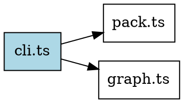
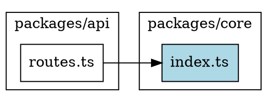

# DOT Format

**File:** `src/output/dot.ts`

## Purpose

DOT output generates graphs in Graphviz DOT language for visualization. Use this format to render dependency graphs as images or interactive diagrams.

## Usage

```bash
# Generate DOT output
repo-slice graph --entry src/index.ts --format dot --out graph.dot

# Render with Graphviz
dot -Tpng graph.dot -o graph.png
dot -Tsvg graph.dot -o graph.svg
```

## Structure



## Visual Styling

### Node Styles

| Node Type | Style |
|-----------|-------|
| Anchor node | Filled with light blue background |
| External node | Dashed border, gray color |
| File | Box shape (default) |
| Class | Ellipse shape |
| Function/Method | Diamond shape |

### Edge Styles

| Edge Type | Style |
|-----------|-------|
| `imports` | Solid line (default) |
| `calls` | Blue color |
| `tests` | Green color, labeled "tests" |
| `calls-dynamic` | Dashed line |
| `calls-unknown` | Dashed line |
| Low confidence (<0.8) | Dotted line |

## Subgraphs

When the graph spans multiple workspaces, nodes are grouped into subgraphs (clusters):



## Rendering Options

### Graphviz Formats

| Format | Command | Use Case |
|--------|---------|----------|
| PNG | `dot -Tpng` | Quick preview, sharing |
| SVG | `dot -Tsvg` | Scalable, web embedding |
| PDF | `dot -Tpdf` | Documentation, printing |

### Layout Engines

| Engine | Description |
|--------|-------------|
| `dot` | Hierarchical (default, best for dependencies) |
| `neato` | Spring model |
| `fdp` | Force-directed |
| `circo` | Circular layout |

```bash
# Use different layout engine
neato -Tpng graph.dot -o graph.png
```

## Determinism

With `--no-timestamp`, DOT output is deterministic:

```bash
repo-slice graph --entry src/index.ts --format dot --no-timestamp
```

Nodes and edges are sorted alphabetically by ID to ensure reproducible output.

## Related

- [Output Overview](./overview.md)
- [Graph JSON Format](./graph-json.md)
- [CLI Examples](../06-cli/examples.md)
